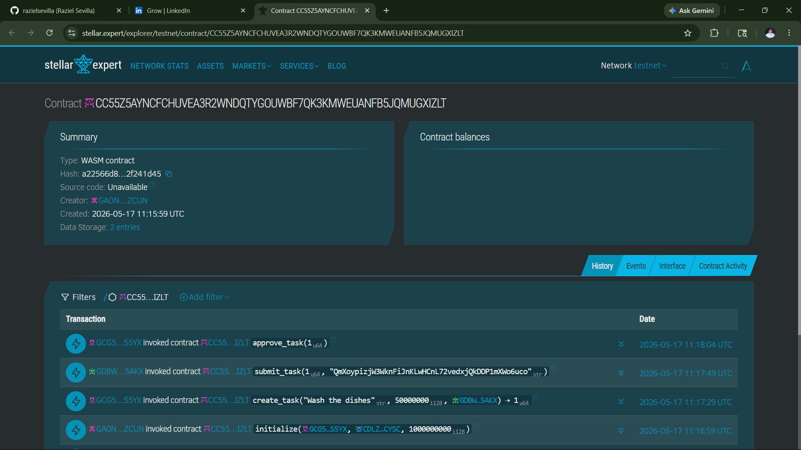
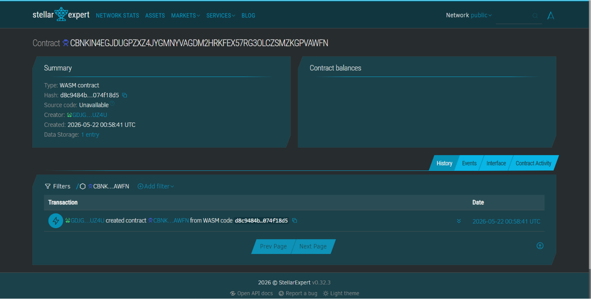

# Toka — Gamifying Household Responsibility, Tokenizing Financial Literacy

> A decentralized family micro-economy app built on the Stellar Network for the Build on Stellar Philippines Hackathon 2026.

---

## 📁 Documentation Index

| File | Description |
|------|-------------|
| [README.md](file:///c:/Users/Raziel/OneDrive/Documents/06_Projects/Stellar/README.md) | This file — project overview and quick start |
| [CHECKIN.md](file:///c:/Users/Raziel/OneDrive/Documents/06_Projects/Stellar/docs/CHECKIN.md) | **Milestone Progress Check-in Guide (Checkpoint 1)** |
| [ARCHITECTURE.md](file:///c:/Users/Raziel/OneDrive/Documents/06_Projects/Stellar/docs/ARCHITECTURE.md) | Full technical architecture and system design |
| [SMART_CONTRACTS.md](file:///c:/Users/Raziel/OneDrive/Documents/06_Projects/Stellar/docs/SMART_CONTRACTS.md) | Soroban smart contract logic and code |
| [STELLAR_INTEGRATION.md](file:///c:/Users/Raziel/OneDrive/Documents/06_Projects/Stellar/docs/STELLAR_INTEGRATION.md) | Stellar SDK integration guide (wallets, assets, trustlines) |
| [FRONTEND.md](file:///c:/Users/Raziel/OneDrive/Documents/06_Projects/Stellar/docs/FRONTEND.md) | React Native / Expo UI guide and component structure |
| [API.md](file:///c:/Users/Raziel/OneDrive/Documents/06_Projects/Stellar/docs/API.md) | Backend API endpoints and data models |
| [TESTING.md](file:///c:/Users/Raziel/OneDrive/Documents/06_Projects/Stellar/docs/TESTING.md) | API and Soroban Contract integration tests |
| [DEMO_SCRIPT.md](file:///c:/Users/Raziel/OneDrive/Documents/06_Projects/Stellar/docs/DEMO_SCRIPT.md) | Hackathon demo day script and pitch guide |
| [EXECUTION_PLAN.md](file:///c:/Users/Raziel/OneDrive/Documents/06_Projects/Stellar/docs/EXECUTION_PLAN.md) | Day-by-day build plan for May 18–24 |

---

## 🧩 Problem
- **Financial Illiteracy:** Filipino youth are typically unbanked and lack practical, hands-on exposure to personal finance, budgeting, and savings at an early age.
- **Remittance Visibility:** Overseas Filipino Workers (OFWs) send remittances home to support their children, but they cannot verify if or how these funds are spent, leading to a lack of accountability.
- **High Transaction Costs:** Micro-rewards for kids' chores (e.g., ₱5–₱20) are traditionally impossible to execute using standard blockchain networks due to high gas fees and slow confirmation times.

## 🌟 Vision
Toka's long-term vision is to bridge the financial inclusion gap in emerging markets by introducing children to non-custodial digital assets and smart-contract-based micro-economies. By linking domestic chores to international remittances, Toka creates a transparent, educational ecosystem that teaches savings habits, financial accountability, and decentralization fundamentals to the next generation of builders.

## 🎯 Purpose
We built Toka to transform chore management from an invisible chore into a visible, educational micro-economy. By replacing abstract points or hard-to-track cash with real digital tokens stored in decentralized wallets, we give youth actual ownership, motivating them to complete household responsibilities while learning the core mechanics of personal finance (earning, saving, interest, taxes, and secondary markets) in a controlled family setting.

## 👥 Target Users
- **🏠 Parents / OFWs (Anchors)**
  - *Needs:* A direct, fee-efficient way to fund family rewards, supervise chores remotely, and teach financial responsibility.
  - *Goal:* Verify tasks are completed and trigger reward payments on-chain with minimal friction.
- **👧 Children / Youth (Earners)**
  - *Needs:* An engaging, gamified interface to view tasks, submit evidence of completion, and manage their earnings.
  - *Goal:* Earn real tokens, track progress towards savings goals, and participate in family marketplace auctions or shop redemptions.

## ✨ Features
- **Soroban Smart Contract Task Lifecycle:** On-chain task creation, submission, parent approvals, and automated token transfers, eliminating trusted intermediaries.
- **Mainnet Sponsor Wallet API:** Custom backend infrastructure that automatically funds user accounts and trustlines directly on the Stellar Mainnet, bypassing gas hurdles.
- **In-App Non-Custodial Key Generation:** In-app key generation (stored securely via `SecureStore`) with automated custom `TOKA` trustline initialization.
- **Dynamic Mascot & UX Visuals:** "TokaBit," an interactive mascot that animates dynamically when transactions occur or when tasks are active.
- **Automated Task Recurrences:** A robust scheduler that handles tasks recurring daily, weekly, monthly, or multiple times per day using `node-cron`.
- **Family Marketplace & Shop Rewards:** Parents configure custom physical/digital rewards that earners can purchase using their earned TOKA tokens.
- **Delayed Gratification Multiplier:** Cashout system where cashing out larger sums over longer save periods rewards children with a higher fiat exchange rate.
- **Sibling Auctions:** Fun bidding wars on family privileges (e.g., choice of weekend movie), where the highest bidder's tokens are transferred back to the family vault on-chain.
- **Taxes & Savings Interest:** Micro-finance controls that allow parents to charge weekly room taxes or offer savings interest yields on child deposits.
- **Push Notification Integration:** Real-time push alerts to parents and earners for task assignments, task approvals, and new auction bids.

## 🛠️ Tech Stack
- **Frontend:** React Native, Expo, Expo Router, Lucide Icons, Expo SecureStore, Expo Linear Gradient
- **Backend:** Node.js, Express, SQLite (via Sequelize), node-cron, JSON Web Tokens (JWT)
- **Blockchain:** Stellar Network (Soroban Smart Contracts, Stellar SDK, Horizon API)
- **Other tools:** Pinata (IPFS for proof photo uploads)

## 🚀 How to Run Locally
```bash
# Clone the repository
git clone https://github.com/Raziel/Stellar.git
cd Stellar

# 1. Set Up the Backend
cd backend
npm install
# Create a .env file and fill in keys (STELLAR_NETWORK, CONTRACT_ID, JWT_SECRET, etc.)
npm run dev

# 2. Set Up the Mobile App (Expo)
cd ../mobile
npm install
npx expo start --clear
```

## 🌐 Deployment

### Testnet
- Contract / App Address: `CC55Z5AYNCFCHUVEA3R2WNDQTYGOUWBF7QK3KMWEUANFB5JQMUGXIZLT`
- 📸 Screenshot — Stellar Expert (Testnet)
  

### Mainnet
- Contract / App Address: `CBNKIN4EGJDUGPZXZ4JYGMNYVAGDM2HRKFEX57RG3OLCZSMZKGPVAWFN`
- 📸 Screenshot — Stellar Expert (Mainnet)
  

## 🎥 Demo
- 🔗 Live App: [Toka Web (Local/Expo)](#)
- 🎬 Demo Video: [Watch on YouTube/Loom](#)
- 🖼️ Pitch Deck: [DECK.md](./docs/Pitch-Deck.pdf)
- 🌐 Landing page: https://stellartokalanding-page.vercel.app/

## 👨‍💻 Team
| Name | Role | GitHub |
|---|---|---|
| Raziel | Lead Developer & Founder | [@Raziel](https://github.com/razielsevilla) |

## 📜 License
MIT
